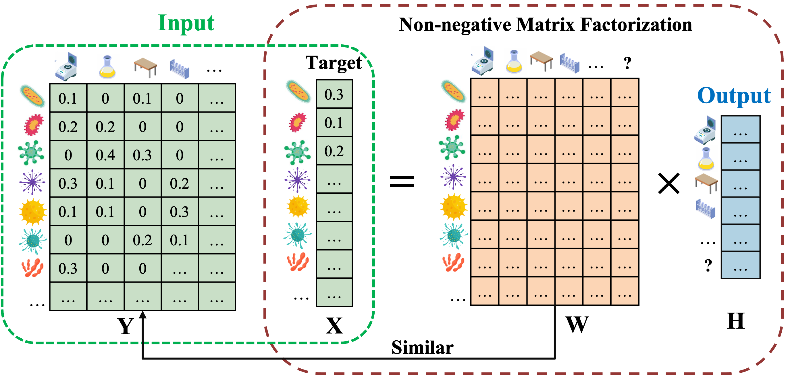

# SourceID-NMF
SourceID-NMF: Towards more accurate microbial source tracking via non-negative matrix factorization.

A major challenge in analyzing the compositional structure of microbiome data is identifying its potential origins. Here, we introduce a novel tool called SourceID-NMF for precise microbial source tracking. SourceID-NMF utilizes a non-negative matrix factorization (NMF) algorithm to trace the microbial sources contributing to a target sample.

<div style="text-align: center;">

</div>


## Support
For support using SourceID-NMF, please email: zhuang82-c@my.cityu.edu.hk

## Required Dependencies
Detailed package information can be found in SourceID-NMF.yaml. The main environment configuration we need includes:
* Conda
* Python >=3.8.13
* numpy >=1.24.3
* pandas >=2.0.3
* tqdm >=4.66.1
* scipy >=1.10.1

We suggest installing SourceID-NMF's environment "*.yml" by using Anaconda after cloning the repository. This will install all the required packages in CPU mode.

The command is: 
```
Linux version
conda env create -f nmf_linux.yml -n nmf

Mac version
conda env create -f nmf_mac.yml -n nmf
```

Alternatively, you can use conda to install all packages, as shown on the command line below:
```
# create a new environment nmf with python 3.8 using conda

conda create -n nmf python=3.8.13

conda activate nmf

pip install numpy pandas tqdm scipy
```

After installing, you only need to activate the "nmf" environment before using SourceID-NMF for the next time.
```
conda activate nmf
```


## Usage

#### Command
```
python SourceID-NMF.py -i ./data/nmf_data.txt -n ./data/name.txt -o ./estimated_proportions.txt -t 8
```

#### Parameters

As input, SourceID-NMF provides some parameters for different purposes. Some of the parameters exist as inputs and outputs of data, including:

```
Options
-i | --input:        A path to an input.txt file: Input of count table.
-n | --name:         A path to an name.txt file: Data labels for input data. 
-o | --output:       A path to an output.txt file: Output of estimated proportions.
-m | --perf:         A path to an output.txt file: Output of model performance including jsd_wy and diff_xwh.
```
Suppose a dataset has 19 sources, represented by D1, D2,... ,D19, and 9 sinks, represented by D20, D21,... , D28.

The input to SourceID-NMF is composed of two txt files:

`-i | --input`

The input count table containing sources and sinks (M by N). where M is the number of samples and N is the number of taxa. Row names are the sample ids ('SampleID'). Column names are the taxa ids. Every consecutive column contains read counts for each sample.

The specific input table case is shown below:

| | D1 | D2 | D3 | ... | D19 | D20 |
| ------------- | ------------- |------------- |------------- |------------- |------------- |------------- |
| taxon_1  |  0 | 5 | 0 | ... | 20 | 5 |
| taxon_2  |  20 | 5 | 0 | ... | 0 | 11 |
| taxon_3  |  0 | 13 | 210 | ... | 0 | 20 |
| taxon_4  |  80 | 6 | 0 | ... | 0 | 0 |
| taxon_5  |  4 | 38 | 0 | ... | 14 | 0 |
| ... | ... | ... | ... | ... | ... | ... |
| taxon_n  |  24 | 25 | 0 | ... | 0 | 14 |

`-n | --name`

The name table contains four columns, 'SampleID', 'Env' and 'SourceSink'. The 'SampleID' column describes the labels for each source data or sink data. The 'Env' column describes the environment to which each source or sink belongs, e.g. the first row Env = 'Electronics' means that the source was collected from Electronics. This 'SourceSink' column describes the source or sink to which the data belongs. 

The specific name table case is shown below:

| SampleID | Env |SourceSink |
| ------------- | ------------- |------------- |
| D1 | Electronic | Source |
| D2 | Hand | Source |
| D3 | Incubator | Source|
| D4 | Surface | Source|
| ... | ... | ... |
| D19 | Tubes | Source |
| D20 | fecal | Sink |

The output to SourceID-NMF is composed of one txt files:

`-o | --output`

The count table contains all the estimated proportions (K by S). where K is the number sinks and S is the number of sources (including an unknown source). The specific value in this table represents the contribution of each source to each sink. The sum of the proportions in each row is 1.

The specific output table case is shown below:

| | D1 | D2 | D3 | ... | D19 | Unknown |
| ------------- | ------------- |------------- |------------- |------------- |------------- |------------- |
| D20 | 0.021288945 |	0.013085965 |	0.008938594 | ... |	0.005083895 |	0.485646292 |


Meanwhile, SourceID-NMF also provides some parameters that may affect the final result, including:
```
Options
-t | --thread:       Max workers for multiprocessing operation. (default:20)
-e | --iter:         Maximum number of iterations for the NMF model. (default:2000)
-r | --rho:          The penalty parameter. (default:1)
-a | --A:            The weighting matrix coefficients. (default:1)
-c | --threshold:    The convergence threshold. (default:1e-06)
-m | --clustering:   The option to cluster similar sources before doing source tracking analysis (default:normal/cluster)
-f | --threshold:    The clustering threshold e.g., JSD < threshold (default:0.25)
```

`-t | --thread`

In SourceID-NMF, we can execute multiple tasks concurrently by creating a thread pool, thus improving the performance and efficiency of the program. This parameter represents the ThreadPoolExecutor parameter max_workers, which specifies the maximum number of threads in the thread pool. We set it to the default value of 20. The selection of this parameter should be less than or equal to the number of CPUs. We can gradually increase the number of parameters to improve the speed of the model iteration.

`-e | --iter`

This parameter represents the maximum number of iterations of the model. We set it to the default value of 2000 iterations. The user can increase the number of iterations as well to observe if the model outputs better results, but again this will consume more running time.

`-r | --rho`

This parameter represents the penalty parameter of the model. We set it to a default value of 1.

`-a | --A`

In SourceID-NMF, we incorporate a weight matrix $A$ to regulate the similarity between the estimated taxa abundance and the observed taxa abundance in the sources. This parameter represents the coefficients of the weighting matrix. We set it to the default value of 1. The user can adjust the value of this parameter to increase the tolerance of the difference between W and Y in the formula. 

`-c | --convergence threshold`

This parameter represents he convergence threshold of the model. We set it to the default value of 1e-06. The model may terminate the iterations early due to the limitations of the convergence threshold before the maximum number of iterations is reached. The user can likewise lower the convergence threshold to see if the model outputs better results, again consuming more running time.

`-m | --clustering`
Because the number of input reference sources is the major factor affecting the running time of SourceID-NMF, reducing the number of input sources will speed up the process. One possible approach is to cluster the sources and use representative sources as input. We incorporate this option into SourceID-NMF for the convenience of our users. If users want to do a rough discovery, they can first cluster the sources and then use representative sources as input for source tracking.

`-f | --clustering threshold`


## Demo
Here, we provide some datasets for SourceID-NMF testing. The /data folder has one test data set containing two txt input files, "nmf_data.txt" and "name.txt". We can run it on the test data by running the following command:

```
python SourceID-NMF.py -i ./data/nmf_data.txt -n ./data/name.txt -o ./estimated_proportions.txt -t 20 -e 2000 -r 1 -a 1 -c 1e-06
```

After running the code, you can find the file 'estimated_proportions.txt' in the folder corresponding to that dataset, which contains the results of the model run, i.e., the contributions of the sources to the sinks. 

Finally, for simulated data, the user can also compare the estimated proportions with the true proportions to evaluate the performance of the model. We output the Jensen-Shannon divergence and the difference between the estimated and true proportions by running the evaluated pipeline and the corresponding average. The specific command is as follows.                     
```
python data_estimation.py -e ./estimated_proportions.txt -t ./data/true_proportions.txt
```
and returns a count table containing the Jensen-Shannon divergence and Difference for each sink. the specific output table situation is as follows:

| | D20 |
| ------------- | ------------- |
| jsd | 0.013199137 |
| diff | 0.034919905 |

## Simulation data
Our simulated data was generated using the microbial data from the Earth's microbiome project [1]. It can be downloaded from http://ftp.microbio.me/emp/release1/otu_tables/closed_ref_greengenes/ [1]. We used the emp cr_gg_13 8.subset 2k.rare 10000.biom file from this link to simulate data.


## References
[1] Thompson, L. R. et al. A communal catalogue reveals Earth’s multiscale microbial diversity. Nature 551, 457–463 (2017).
